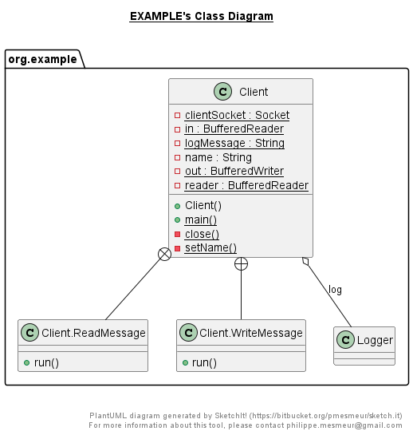

# Курсовая работа "Сетевой чат"
## Схема работы программы
### Серверная часть

Класс Server:
- считывает номер порта для подключения клиентов через файл настроек settings.txt
- внутри фунции main создает экземпляр класса ServerSocket, который передается в конструктор класса ServeClient предназначенного для обслуживания соединения с клиентом. Экземпляры объекта ServeClient добавляются в список serverList. Каждое соединение обрабатывается в отдельном потоке.

Класс Logger с помощью метода logging() записывает все полученные сообщения в file.log.

### Клиентская часть

Класс Client:
- в конструкторе считывает номер порта и ip-адрес через файл настроек settings.txt, создает сокет, поток для чтения из сокета, поток для записи в сокет
- создает поток ReadMessage для получения сообщений
- создает поток WriteMessage для отправки сообщений

Классы Client1Run и Client2Run создают экземпляры класса Client.